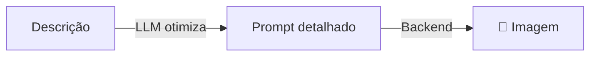

# Artist Agent

Agente especializado em **gerar e editar imagens** com prompts otimizados pelo LLM.

## Como funciona



O `ArtistAgent` usa o LLM para transformar descrições simples em prompts detalhados e otimizados antes de gerar a imagem.

## Uso

```python
from omniachain import ArtistAgent, OpenAI, Google

# Com DALL-E 3
artist = ArtistAgent(provider=OpenAI(), image_backend="openai")

# Com Google Nano Banana
artist = ArtistAgent(provider=Google(), image_backend="google")

# Com Stable Diffusion local
artist = ArtistAgent(provider=OpenAI(), image_backend="comfyui")
```

## Gerar Imagem

```python
# O LLM otimiza o prompt automaticamente
await artist.create("Logo para minha cafeteria", "logo.png")

# Sem otimização (prompt direto)
await artist.create(
    "A minimalist logo for a coffee shop, flat design, warm tones",
    "logo.png",
    optimize_prompt=False,
)
```

## Variações

```python
paths = await artist.create_variations(
    "Retrato de gato com óculos",
    output_dir="./gatos",
    n=4,
)
# → gatos/image_1.png, image_2.png, image_3.png, image_4.png
```

## Editar Imagens

```python
await artist.edit_image(
    "foto.png",
    "Mude o fundo para uma praia ao pôr do sol",
    output_path="foto_praia.png",
)
```

## Parâmetros

| Param | Tipo | Default | Descrição |
|-------|------|---------|-----------|
| `provider` | `BaseProvider` | — | Provider LLM |
| `image_backend` | `str` | `"auto"` | Backend de geração |
| `tools` | `list[Tool]` | `[]` | Tools extras |
| `system_prompt` | `str` | — | Prompt de sistema |

!!! info "Prompt Optimization"
    Quando `optimize_prompt=True` (padrão), o agente usa o LLM para criar prompts em inglês otimizados para o backend, incluindo detalhes de estilo, iluminação, composição e técnica artística.
