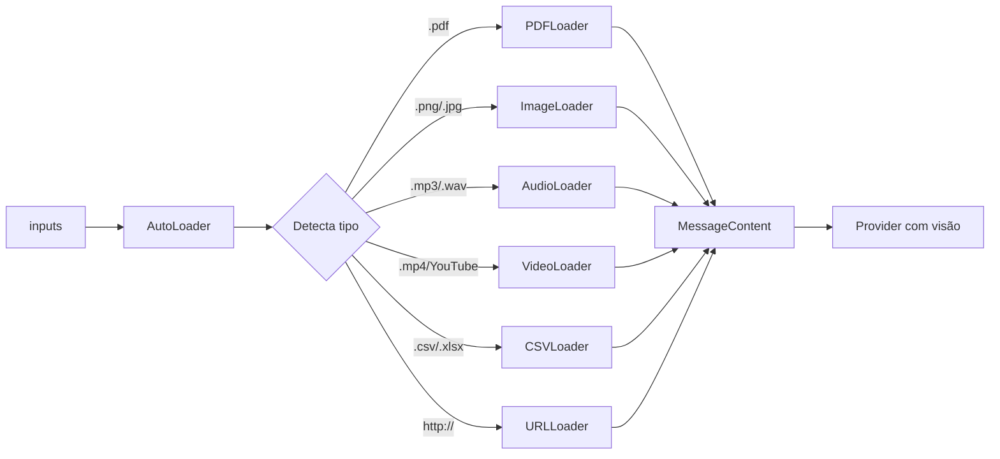

# Multimodal Agent

Processa **qualquer tipo de input**: texto, PDF, imagem, áudio, vídeo, CSV, URL.

## Uso

```python
from omniachain import MultimodalAgent, OpenAI

agent = MultimodalAgent(provider=OpenAI("gpt-4o"))

result = await agent.run(
    "Analise todos esses dados e gere um resumo executivo",
    inputs=[
        "relatorio.pdf",           # PDF → texto extraído
        "grafico_vendas.png",      # Imagem → base64 (visão)
        "dados.csv",               # CSV → tabela + estatísticas
        "entrevista.mp3",          # Áudio → transcrição Whisper
        "apresentacao.mp4",        # Vídeo → frames + áudio
        "https://example.com",     # URL → scraping
    ],
)
```

## Como funciona internamente



## Tipos Suportados

| Extensão | Loader | O que faz |
|----------|--------|-----------|
| `.pdf` | PDFLoader | Extrai texto com PyPDF |
| `.png/.jpg/.webp` | ImageLoader | Base64 para visão nativa |
| `.mp3/.wav/.ogg` | AudioLoader | Transcrição com Whisper |
| `.mp4/.avi/.mkv` | VideoLoader | **Frames + transcrição** |
| `.csv/.xlsx` | CSVLoader | Pandas: dados + estatísticas |
| `.py/.js/.ts` | CodeLoader | Código com syntax info |
| `http://...` | URLLoader | Scraping com BeautifulSoup |
| YouTube URL | VideoLoader | Download + frames + áudio |

## Vídeo: 3 Camadas

O `VideoLoader` é único — nenhum framework faz isso:

1. **📸 Frames-chave**: Extrai N frames distribuídos → base64 → modelo vê
2. **🎵 Áudio**: Extrai trilha → transcrição Whisper
3. **📊 Metadados**: Duração, resolução, codec, FPS

```python
from omniachain.loaders.video import VideoLoader

loader = VideoLoader(num_frames=6, transcribe_audio=True)
contents = await loader.load("video.mp4")
# → [resumo, frame1, frame2, ..., frame6, transcrição]
```

!!! warning "Requisito"
    VideoLoader e AudioLoader precisam do **ffmpeg** instalado no sistema.
