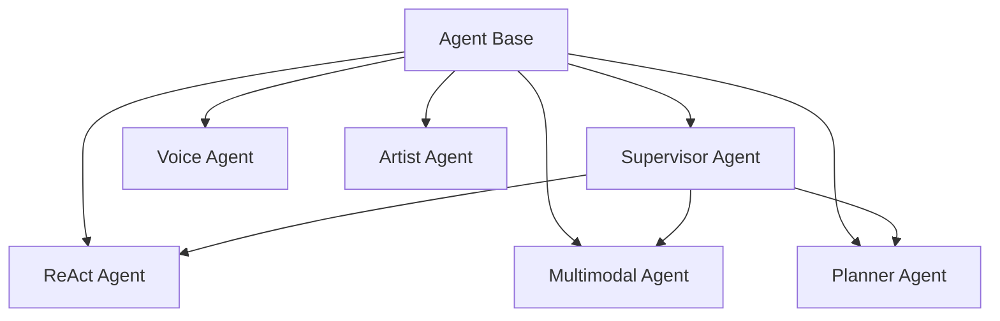

# Agentes

O OmniaChain oferece **6 tipos de agentes** especializados, todos com tool calling e memória.

## Visão Geral



| Agente | Especialidade | Quando usar |
|--------|--------------|-------------|
| `Agent` | Geral | Tarefas simples |
| `ReActAgent` | Reason + Act | Pesquisa, raciocínio encadeado |
| `MultimodalAgent` | Qualquer input | PDF, imagem, áudio, vídeo |
| `PlannerAgent` | Plan → Execute → Review | Tarefas complexas em etapas |
| `SupervisorAgent` | Coordena sub-agentes | Multi-agente com delegação |
| `VoiceAgent` | STT → LLM → TTS | Conversa por voz |
| `ArtistAgent` | Gera imagens | Criação de imagens com prompts otimizados |

## Agent Base

O agente mais simples — serve para 80% dos casos:

```python
from omniachain import Agent, OpenAI, calculator, web_search

agent = Agent(
    provider=OpenAI("gpt-4o-mini"),
    tools=[calculator, web_search],
    memory="buffer",                    # Lembra conversa
    system_prompt="Responda em PT-BR.",
    max_iterations=10,                  # Máx. loops de raciocínio
)

result = await agent.run("Quanto é 15% de R$320?")
```

### Parâmetros

| Param | Tipo | Descrição |
|-------|------|-----------|
| `provider` | `BaseProvider` | Provider de IA |
| `tools` | `list[Tool]` | Tools disponíveis |
| `memory` | `str \| Memory` | `"buffer"`, `"summary"`, ou instância |
| `system_prompt` | `str` | Prompt de sistema |
| `max_iterations` | `int` | Máx. ciclos de tool calling |
| `keypair` | `KeyPair` | Chave PGP do agente |
| `permissions` | `Permissions` | Regras de acesso |

---

!!! tip "Próximo"
    Veja os agentes especializados: [ReAct](react.md) · [Multimodal](multimodal.md) · [Planner](planner.md) · [Supervisor](supervisor.md) · [Voice](voice.md) · [Artist](artist.md)
