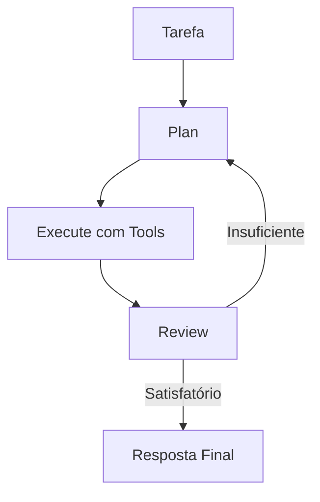

# Planner Agent

Segue o ciclo **Plan → Execute → Review** para tarefas complexas.

## Uso

```python
from omniachain import PlannerAgent, Anthropic, web_search, file_write

agent = PlannerAgent(
    provider=Anthropic(),
    tools=[web_search, file_write],
)

result = await agent.run("Crie um relatório sobre tendências de IA em 2025")
print(result.metadata["plan"])    # O plano criado
print(result.metadata["review"])  # A revisão do resultado
```

## Ciclo de Execução



1. **Plan**: LLM cria plano detalhado com steps numerados
2. **Execute**: Roda o BaseAgent com tools para cada step
3. **Review**: LLM avalia se o resultado atende ao objetivo

## Quando usar

- ✅ Relatórios e pesquisas longas
- ✅ Tarefas com múltiplas etapas dependentes
- ✅ Quando a qualidade do resultado importa mais que velocidade
- ❌ Perguntas simples (use `Agent`)
