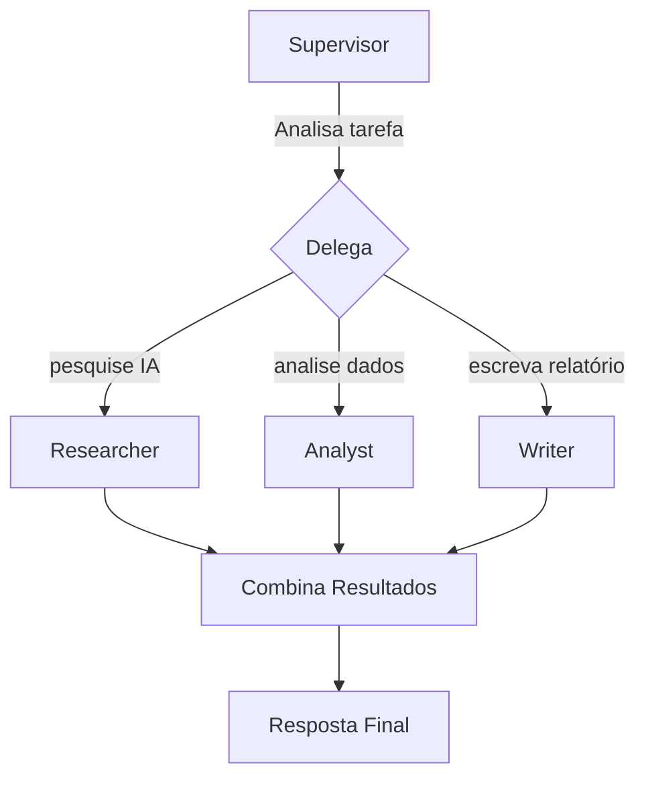

# Supervisor Agent

Coordena **múltiplos agentes especializados** — delega sub-tarefas e combina resultados.

## Uso

```python
from omniachain import (
    Anthropic, Groq, OpenAI,
    ReActAgent, PlannerAgent, SupervisorAgent,
    web_search, calculator, file_write,
)

# Agentes especializados
researcher = ReActAgent(provider=Anthropic(), tools=[web_search], name="researcher")
analyst = ReActAgent(provider=Groq(), tools=[calculator], name="analyst")
writer = ReActAgent(provider=OpenAI(), tools=[file_write], name="writer")

# Supervisor coordena
supervisor = SupervisorAgent(
    provider=Anthropic(),
    sub_agents=[researcher, analyst, writer],
)

result = await supervisor.run(
    "Pesquise IA em 2025, analise os dados e escreva um relatório"
)

print(result.metadata["agents_used"])   # ["researcher", "analyst", "writer"]
print(result.metadata["delegations"])   # Quem fez o quê
```

## Fluxo de Execução



## Formato de Delegação

O Supervisor usa o formato:
```
DELEGATE: researcher -> Pesquise as tendências de IA em 2025
DELEGATE: analyst -> Analise os dados encontrados
DELEGATE: writer -> Escreva o relatório final
```

## Multi-Provider

Cada agente pode usar um **provider diferente** — otimizando custo:

| Agente | Provider | Razão |
|--------|----------|-------|
| Researcher | Anthropic (Claude) | Melhor para pesquisa |
| Analyst | Groq (Llama 3) | Rápido e gratuito |
| Writer | OpenAI (GPT-4o) | Melhor escrita |
