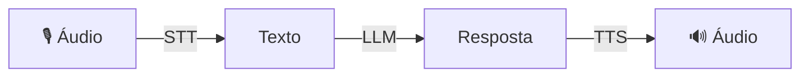

# Voice Agent

Agente que conversa via voz — **STT → LLM → TTS** em um pipeline automatizado.

## Como funciona



## Uso

```python
from omniachain import VoiceAgent, OpenAI, Groq

# Configuração básica
agent = VoiceAgent(provider=OpenAI())

# Configuração completa
agent = VoiceAgent(
    provider=Groq(),
    stt_backend="whisper-local",      # STT local
    tts_backend="edge",               # TTS gratuito
    tts_voice="pt-BR-AntonioNeural",  # Voz pt-BR
    language="pt",
    system_prompt="Responda de forma curta e direta.",
)
```

## Processar Áudio

```python
# Áudio de entrada → áudio de resposta
audio_resposta = await agent.listen_and_respond("pergunta.mp3")

# Salvar resposta em arquivo
audio = await agent.listen_and_respond(
    "pergunta.mp3",
    output_path="resposta.mp3",
)

# Apenas texto (sem TTS)
texto = await agent.listen_and_respond_text("pergunta.mp3")
```

## Chat Interativo

Modo terminal onde o usuário digita e o agente responde:

```python
await agent.chat()
```

```
🎙️ VoiceAgent — Modo Interativo

Você: Qual a capital do Brasil?
🤖 Agente: A capital do Brasil é Brasília.

Você: ^C
Conversa encerrada.
```

## Parâmetros

| Param | Tipo | Default | Descrição |
|-------|------|---------|-----------|
| `provider` | `BaseProvider` | — | Provider de IA (LLM) |
| `tools` | `list[Tool]` | `[]` | Tools disponíveis |
| `stt_backend` | `str` | `"auto"` | Backend de STT |
| `tts_backend` | `str` | `"auto"` | Backend de TTS |
| `tts_voice` | `str` | `None` | Voz para TTS |
| `language` | `str` | `"pt"` | Idioma |
| `system_prompt` | `str` | — | Prompt de sistema |

!!! tip "Dica"
    Use `stt_backend="whisper-local"` + `tts_backend="edge"` para um agente 100% gratuito (exceto o LLM).
