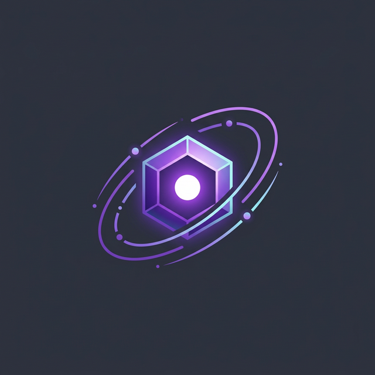

<div align="center">
  
  <h1>OmniaChain</h1>
</div>

**Framework Python para agentes de IA — async-first, multi-modal, MCP nativo.**

<div class="grid cards" markdown>

- :rocket: **Async-first** — `asyncio` em tudo, zero bloqueio
- :art: **Multi-modal** — Texto, PDF, imagem, áudio, vídeo, CSV, URL
- :robot: **5 Providers** — Anthropic, OpenAI, Groq, Ollama, Google
- :shield: **Segurança PGP** — Controle de acesso com chaves criptográficas
- :jigsaw: **MCP nativo** — Model Context Protocol da Anthropic
- :busts_in_silhouette: **Multi-agente** — Supervisor, ReAct, Planner

</div>

---

## Início Rápido

```python
from omniachain import Agent, Anthropic, calculator, web_search

agent = Agent(
    provider=Anthropic(),
    tools=[calculator, web_search],
)

result = await agent.run("Quanto é 1547 × 32 + √144?")
print(result.content)  # "49.516"
```

**3 linhas. Sem boilerplate. Pronto.**

---

## Por que OmniaChain?

| vs LangChain | OmniaChain |
|---|---|
| Misto sync/async | **100% async** |
| ~20 linhas para um agente | **3 linhas** |
| Sem suporte MCP | **MCP nativo** |
| Sem segurança | **PGP completo** |
| Sem análise de vídeo | **Frames + Transcrição** |

---

## Navegação

Explore a wiki pela **sidebar à esquerda** :material-arrow-left: ou use a **busca** :material-magnify: no topo.

!!! tip "Recomendação"
    Comece por [Instalação](getting-started/installation.md) → [Primeiro Agente](getting-started/first-agent.md)
