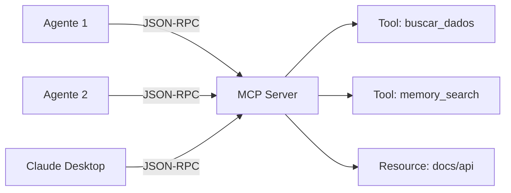

# MCP — Model Context Protocol

O OmniaChain tem suporte **nativo** ao MCP da Anthropic — server, client e transports.

## O que é MCP?

MCP é um protocolo padronizado para expor tools, resources e prompts via JSON-RPC. Permite que **qualquer agente** acesse tools de **qualquer servidor**.

## Quando usar

| Cenário | Solução |
|---------|---------|
| Tools no mesmo processo | `@tool` decorator |
| Tools compartilhadas entre agentes | **MCP Server** |
| Conectar com Claude Desktop | **MCP Server (stdio)** |
| Acessar tools de servidor externo | **MCP Client** |

!!! tip "Próximo"
    - [Criar MCP Server](server.md)
    - [Usar MCP Client](client.md)
