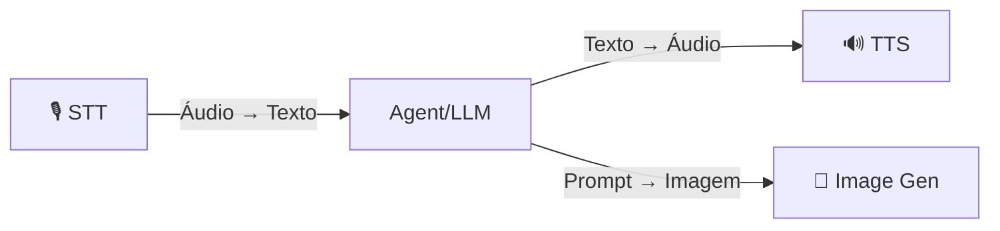

# Mídia: STT, TTS & Imagens

O OmniaChain oferece **3 serviços de mídia** com backends plugáveis — APIs pagas e alternativas 100% gratuitas/locais.

## Visão Geral



| Serviço | Classe | Backends Built-in |
|---------|--------|-------------------|
| **Speech-to-Text** | `SpeechToText` | `openai`, `whisper-local`, `faster-whisper`, `google` |
| **Text-to-Speech** | `TextToSpeech` | `openai`, `edge` ⭐, `coqui`, `google` |
| **Geração de Imagens** | `ImageGenerator` | `openai`, `google`/`nano-banana`, `stability`, `comfyui` |

!!! tip "Gratuitos"
    - **Edge TTS** — TTS grátis da Microsoft, sem API key, vozes pt-BR de alta qualidade
    - **Whisper Local** — STT rodando 100% offline
    - **ComfyUI** — Stable Diffusion local, sem custo

## Quick Start

```python
from omniachain import SpeechToText, TextToSpeech, ImageGenerator

# STT — Transcrever áudio
stt = SpeechToText(backend="auto")
texto = await stt.transcribe("audio.mp3")

# TTS — Sintetizar voz (Edge TTS = grátis)
tts = TextToSpeech(backend="edge", voice="pt-BR-AntonioNeural")
await tts.speak_to_file("Olá mundo!", "saida.mp3")

# Gerar Imagem (DALL-E, Nano Banana, etc.)
gen = ImageGenerator(backend="openai")
await gen.generate_to_file("Um gato astronauta", "gato.png")
```

## Backend Customizado

Plugue **qualquer API** em 3 linhas:

```python
from omniachain.media.image_gen import ImageBackend, ImageGenerator

class MidjourneyBackend(ImageBackend):
    async def generate(self, prompt, size="1024x1024", n=1, **kw):
        # chamar sua API aqui
        return [image_bytes]

ImageGenerator.register_backend("midjourney", MidjourneyBackend)
gen = ImageGenerator(backend="midjourney")
```

O mesmo padrão funciona para `STTBackend` e `TTSBackend`.

## Agentes Especializados

| Agente | Classe | O que faz |
|--------|--------|-----------|
| **VoiceAgent** | `VoiceAgent` | STT → LLM → TTS (conversa por voz) |
| **ArtistAgent** | `ArtistAgent` | Gera imagens com prompts otimizados pelo LLM |

```python
from omniachain import VoiceAgent, ArtistAgent, OpenAI

# Agente de voz
voice = VoiceAgent(provider=OpenAI(), tts_backend="edge")
audio = await voice.listen_and_respond("pergunta.mp3")
await voice.chat()  # Modo interativo no terminal

# Agente artista
artist = ArtistAgent(provider=OpenAI(), image_backend="openai")
await artist.create("Logo para café minimalista", "logo.png")
```

## Tools

Qualquer agente pode usar as tools de mídia:

```python
from omniachain import Agent, Groq, speech_to_text, text_to_speech, generate_image

agent = Agent(
    provider=Groq(),
    tools=[speech_to_text, text_to_speech, generate_image],
)

result = await agent.run("Transcreva o arquivo audio.mp3 e depois leia o texto em voz alta")
```

---

!!! info "Próximo"
    Veja detalhes de cada serviço: [STT](stt.md) · [TTS](tts.md) · [Geração de Imagens](image-gen.md)
