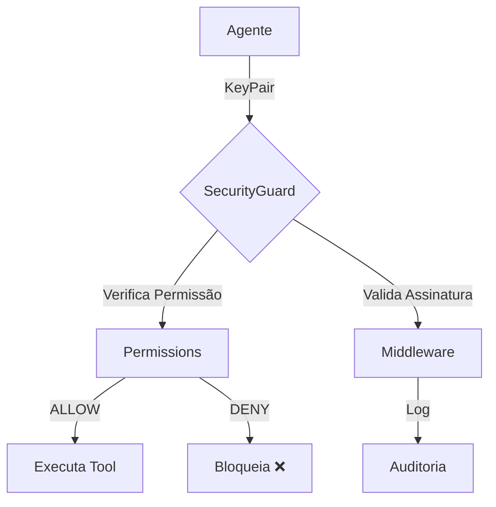

# Segurança PGP

O OmniaChain implementa controle de acesso com **chaves PGP** — cada agente tem identidade criptográfica.

## Arquitetura



## 1. Gerar Chaves

```python
from omniachain import KeyPair

keys = await KeyPair.generate(agent_name="admin")
print(keys.fingerprint)   # "a1b2c3d4e5f6..."
print(keys.public_key)    # Chave pública
print(keys.private_key)   # Chave privada
```

!!! info "GPG vs HMAC"
    Se `python-gnupg` estiver instalado, usa **GPG real**. Senão, usa **HMAC-SHA256** como fallback seguro.

## 2. Configurar Permissões

```python
from omniachain import Permissions

perms = Permissions()

# Admin acessa tudo
perms.grant(admin_keys.fingerprint, all_resources=True)

# Analyst só pode usar calculator e web_search
perms.grant(analyst_keys.fingerprint, tools=["calculator", "web_search"])
perms.deny(analyst_keys.fingerprint, tools=["code_exec", "file_write"])

# Verificar
perms.can_access(analyst_keys.fingerprint, "tool", "calculator")   # True
perms.can_access(analyst_keys.fingerprint, "tool", "code_exec")    # False
```

### Regras de Acesso

| Método | Efeito |
|--------|--------|
| `grant(fp, tools=[...])` | Permite tools específicas |
| `grant(fp, memory=[...])` | Permite operações de memória |
| `grant(fp, all_resources=True)` | Permite **tudo** |
| `deny(fp, tools=[...])` | Bloqueia tools (prioridade!) |

!!! warning "DENY > ALLOW"
    Regras `deny` **sempre** têm prioridade sobre `grant`.

## 3. Agente com Segurança

```python
agent = Agent(
    provider=OpenAI(),
    tools=[calculator, web_search, code_exec],
    keypair=analyst_keys,
    permissions=perms,
)

# O agente SÓ pode usar calculator e web_search
# Se tentar code_exec → "Acesso negado"
```

## 4. Middleware (API)

Para validar requisições externas:

```python
from omniachain.security.middleware import SecurityMiddleware

middleware = SecurityMiddleware(permissions=perms)

# Valida: assinatura + permissão + timestamp
req = await middleware.validate_request(
    keypair=agent_keys,
    resource_type="tool",
    resource_name="web_search",
)

# Log de auditoria
for entry in middleware.get_audit_log():
    print(f"[{entry['decision']}] {entry['agent']} → {entry['resource']}")
```
